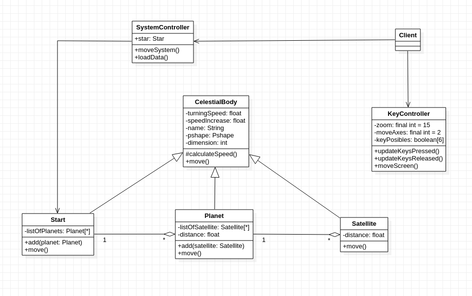

# Solar-System


## Autor
Miguel Ángel Medina Ramírez <br>
Correo: miguel.medina108@alu.ulpgc.es

## Índice
1. [Introducción](#introducción)
2. [Demostración](#demostración)
3. [Dependencias](#dependencias)
4. [Implementación](#implementación)<br>
 4.1. [Diseño de clases](#diseño-de-clases)<br>
 4.2. [Transformaciones y rotación](#transformaciones-y-rotación)<br>
5. [Eventos y Controles](#eventos-y-controles)
6. [Bibliografía](#bibliografía)

## Introducción
Esta práctica consiste en diseñar un sistema planetario mediante transformaciones y rotaciones de figuras. Se ha elegido las esferas como figuras 3D para representar los astros, además se han añadido texturas y textos. Asimos el programa dispone de una seríe de controles para que el usuario se pueda mover en el espacio del sistema mínimamente.

## Demostración
<p align="center"> 
   </img>
   <p align="center">Figura 1: Gif de demostración</p>
</p>

## Dependencias
Para poder ejecutar y probar la práctica solamente se necesita clonar este repositorio y el editor de processing con la siguiente dependencia:
- La librería **GifAnimation** para poder reproducir y guardar gifs. Como esta librería no forma parte necesaria para la correcta implementación de la práctica, en el código toda la lógica relacionada con ella se encuentra comentada, además de que afecta al rendimiento de la aplicación.En este [enlace](https://github.com/extrapixel/gif-animation) se encuentra la forma de instalarla.

## Implementación
Se ha empleado el uso del patrón de diseño **composite** para implementar la relaciones entre los astros planetarios.

### Diseño de clases
<p align="center"> 
   </img>
   <p align="center">Figura 2: Diagrama de clases</p>
</p>

### Transformaciones y rotación

El método *move* es el encargado de implementar la lógica necesaria para representar los astros, además de haceros girar y moverse. Se han usado las primitivas básicas de processing como *pushMatrix*, *popMatrix*, *rotate* y *translate* para implementar el movimiento y rotación simulando el comportamiento de los planetas.

Para las estrellas:

```java
  @Override
  public void move(){
    pushMatrix();
    rotateY(radians(super.turningSpeed));
    text(super.name,0,-super.dimension*2);
    shape(super.pshape);
    popMatrix();
    for(Planet planet:listOfPlanets){
      planet.move();
    }
    super.calculateSpeed();
  }
```

Para los planetas:

```java
  @Override
  public void move(){
    pushMatrix();
    rotateY(radians(super.turningSpeed));
    translate(distance,0,0);
    text(super.name,0,-super.dimension*2);
    shape(super.pshape);
    for(Satellite satellite:listOfSatellite){
      satellite.move();
    }
    popMatrix();
    super.calculateSpeed();
  }
```

Para los satélites:

```java
  @Override
  public void move(){
    pushMatrix();
    rotateZ(radians(super.turningSpeed));
    translate(distance,0,0);
    text(super.name,0,-super.dimension*2);
    shape(super.pshape);
    popMatrix();
    super.calculateSpeed();
  }
```

## Eventos y Controles

<table style="width:100%">
  <tr>
    <th>Tecla</th>
    <th>Uso</th>
  </tr>
  <tr>
    <td>w</td>
    <td>Mover la vista hacia arriba</td>
  </tr>
  <tr>
    <td>s</td>
    <td>Mover la vista hacia abajo</td>
  </tr>
  <tr>
    <td>a</td>
    <td>Mover la vista hacia la izquierda</td>
  </tr>
  <tr>
    <td>d</td>
    <td>Mover la vista hacia la derecha</td>
  </tr>
  <tr>
    <td>Flechas del teclado</td>
    <td>Mover el angulo de visión</td>
  </tr>
</table>

Se puede hacer uso de las ruedas del ratón para hacer zoom sobre el sistema planetario.


## Bibliografía

* [Guion de prácticas](https://cv-aep.ulpgc.es/cv/ulpgctp20/pluginfile.php/126724/mod_resource/content/22/CIU_Pr_cticas.pdf)
* [processing.org](https://processing.org/)
